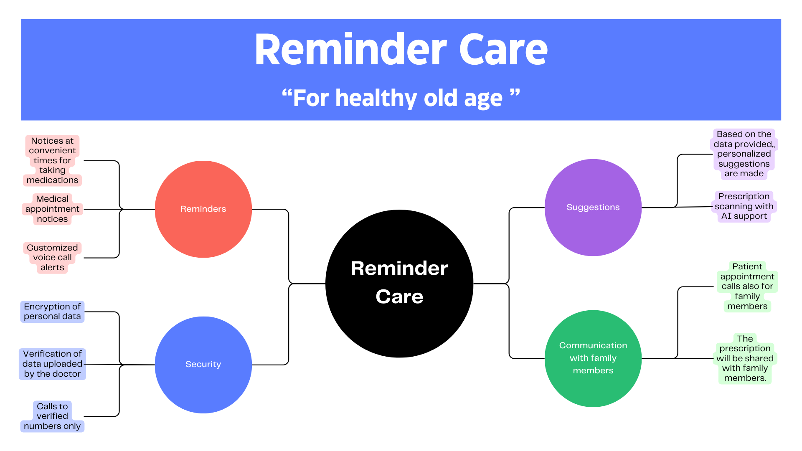

# hackMorelos
## Introduction

Noncommunicable diseases (NCDs) kill 41 million people annually, representing 74% of all deaths worldwide. These diseases affect all age groups and regions but are often linked to older age. Factors such as unplanned urban development, unhealthy lifestyles, and aging populations fuel NCDs. To combat this, early detection, screening, treatment, and palliative care are essential. Cost-effective government solutions can reduce common risk factors by tracking disease trends and progression.

"Reminder Care" aims to provide tools for pediatricians to send continuous treatment reminders via auditory stimuli, optimizing health control in older adults.

## Justification

Medication adherence is crucial to avoid complications such as increased adverse effects, drug resistance, and morbidity. According to the World Health Organization (WHO), non-adherence is a major barrier to realizing the full benefits of medication, with adherence in chronic disease patients in developed countries at only 50%.

Key barriers to medication adherence include:
- **Patient-Specific Barriers**: Lack of information, motivation, and understanding of medication regimens.
- **Illness-Specific Barriers**: Misunderstandings and poor awareness about medication necessity.
- **Healthcare and System-Specific Barriers**: Issues related to healthcare delivery and patient support.

Patient-focused solutions like reminder apps can help, but not all users, especially older adults, have access to or are comfortable with smartphones.

## State of the Art

Aging increases the prevalence of chronic diseases, leading to higher medication use and potential non-adherence. This can result in higher readmission rates, prolonged hospitalizations, and increased healthcare costs. Addressing medication adherence in older adults is key to improving their health outcomes.

### Identified Problems:
1. Lack of understanding or follow-up on medication regimens.
2. Difficulty adapting to medication information when ill.
3. Misconceptions about medication and lack of motivation.
4. Risk points such as lack of routine and stress.
5. Poor health literacy and difficulties with written language.
6. Comorbidities increasing non-adherence risk.

## Development of the App

"Reminder Care" is designed for older adults to improve health management and quality of life. The app maintains a database of medication schedules, medical appointments, and uses AI to provide personalized recommendations. It reminds users of medication times, doses, and upcoming appointments through phone calls, a reliable and familiar communication method for older adults.

### System Overview:

By leveraging simple phone calls, "Reminder Care" ensures ease of use and accessibility for older adults, promoting better health outcomes through improved medication adherence and health management.

